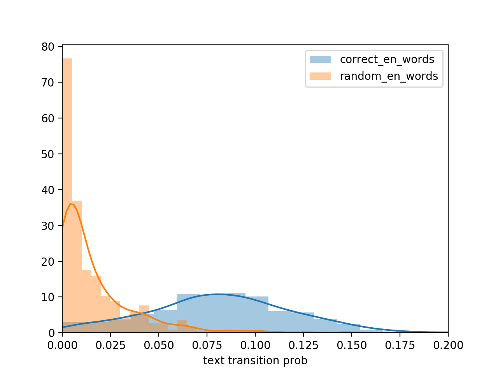

text-trans
===

It computes a transition probability of a text.


## Description

I want to determine if a word was randomly generated. 
I guess that it can be determined by text transition probabilities trained from correct words.


## Vertify

I trained transition probability using almost english words. 
I computed and compared probability for english words learned at junior high school in Japan, and randomly generated words.
From the figure below, it can see that each peak is different.




## Install

```shell
$ pip install texttrans
```


## Usage


### default

Transition probability is computed for English words. I use "words_alpha.txt" of [dwyl/english-words](https://github.com/dwyl/english-words) to train default probability.

```python
from texttrans.texttrans import TextTrans
p = TextTrans().prob("pen")
print(p)
```

```
0.11640052876679541
```

### training

It prepares a text file that lists words, e.g. like below.

```txt:train.txt
hogehoge
piyopiyo
```

It train text transtion of input text.

```python
from texttrans.texttrans import TextTrans

train_path = "train.txt"
model_path = "model.pki"

tt1 = TextTrans(lang=None)
tt1.train(train_path= train_path, save_path= model_path)
print("p =", tt.prob("hoge"))
```

It computes the probability according to trained model.

```
tt2 = TextTrans(model_path=model_path)
print("p =", tt.prob("hoge"))
```

## Licence

[MIT](https://github.com/mitsuharu/text-trans/blob/master/LICENSE)


## Appendix

- [kyotolt22_20181109.pdf - Speaker Deck](https://speakerdeck.com/mitsuharu/kyotolt22-20181109)
- [ランダムな文字列を判定したい - Qiita](https://qiita.com/mitsuharu_e/items/309288b68220adddaf8b#pypi%E3%81%AB%E7%99%BB%E9%8C%B2%E3%81%97%E3%81%BE%E3%81%97%E3%81%9F%E8%BF%BD%E8%A8%98-20190605)

